# Travel with Fun Blog

Welcome to Travel with Fun Blog. As a siteuser, people can share their exciting travel experience with others. The goal of the website is to motivate people for travelling.

The live view of the site can be found [here](https://travelblogdjango-d9e22c4148cf.herokuapp.com/)

# Table of Contents

1. [Overview](#overview)
2. [UX](#ux)
   - [User Stories](#user-stories)
   - [Agile Methodology](#agile-methodology)
3. [Design](#design)
   - [Color Scheme](#color-scheme)
   - [Imagery](#imagery)
   - [Data Models](#data-models)

# Overview

Travel with Fun Blog is a fully responsive website used for travelling motivation purpose. Here users have the freedom to upload and modify their contents. This is a playground for travelling lovers.

# UX

## User Stories

 1. View and create blog posts

 2. User Registration and Login

 3. User can delete his own post

 4. Create Database to enter post

 5. Create site user app

 6. Create User Profile

 7. User Can edit his own post

 8. Create storage for media files after deployment in Heroku

 9. Create Automatd Test

## Agile Methodology

Agile methodology has been used to create user stories and develop features according to the stories. The user story board can be viewed [here](https://github.com/users/farhatamannaislam/projects/3/views/1)

# Design 

## Color Scheme

The main color palette of the website is given below:

  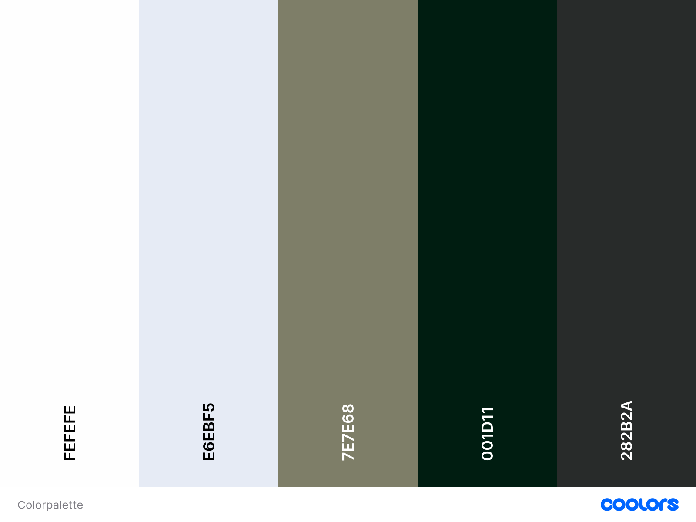

## Imagery

The imagery used in this website are all real life photos. Only the favicon is an animated picture.

## Data Models

Data models were drawn before implementing it into the SW. It serves as a blue print of the data base design.

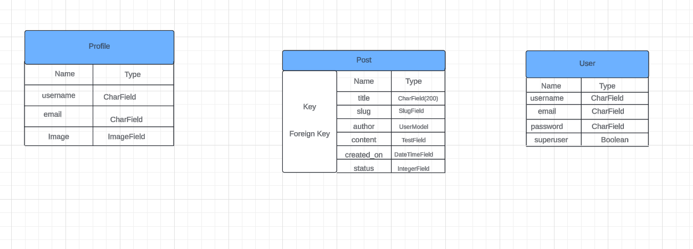

## Relationship:

### Post

* User (OneToMany): One user can write several blog posts. This is a OneToMany relationship. 

### Profile

* User (OneToOne): Each user has a single user profile. This is a OneToOne relationship.

## Wireframes

Wireframes are given here.

# Security

## eny.py

* API keys and database are stored in the env.py file. This file is included in gitignore to prevent exposure in version control.

## Secured Programming

* In some places login required action is is used to prevent unauthorized entry and actions into the website. 

## Authentication

* Django library django-allauth is used for user authentication. This provides a secure authentication for sign up, login and logout.

# Features

## General features

* The site is fully responsive. 

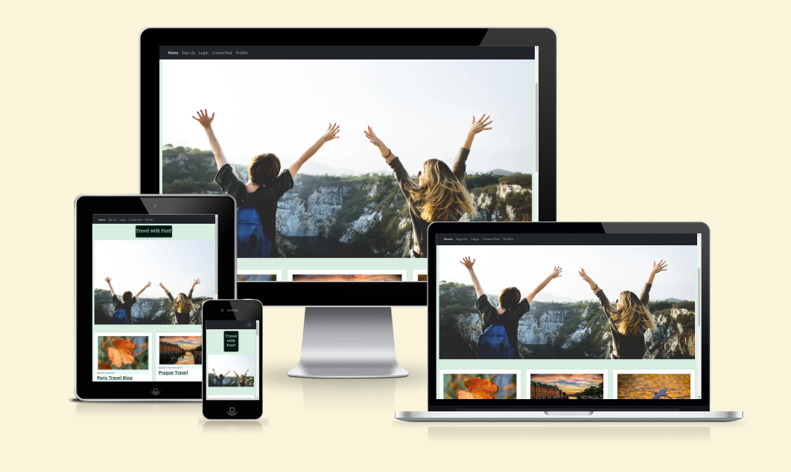

* Navigaions are on the top left corner. 

* Social media links are given in the footer.

* Blog contents with writer name and creation date are found on the Home Page.

## Home Page

* Navigation: On the top left corner of the Home Page there are navigations available. For a new user the Navigation will be seen as Home, Sign Up, Login, Cretae Post, Profile.

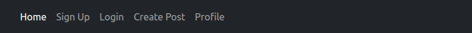

* Navigation: If an user is signed up he/she has the navigation of Home , Logout, Create Post and Profile.

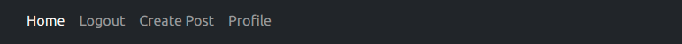

* Header: Header is under navigation bar and in the middle of the page. It is called "Travel with Fun!!"

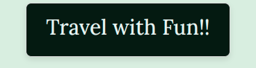

* Cover Image: There is an Enthusiastic Cover Image in the Home Page.

* Blog Menu: Under the Cover Image there are blog menu with blog title, respective author name and creation date. If the user clicks the title he/she will
be redirected to the content. 

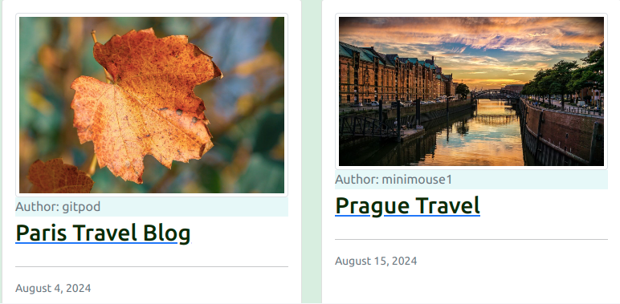

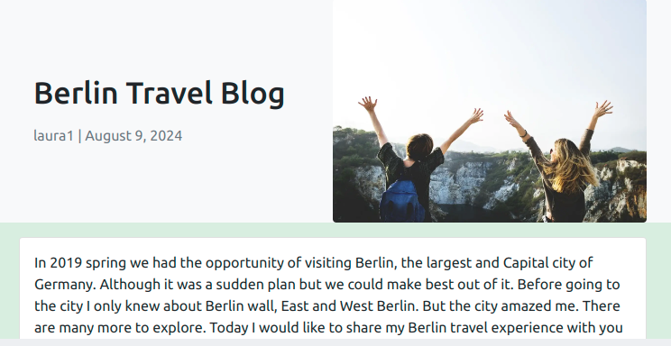

## Sign Up Page

For the new users there is the sign up page with Username, email address (optional), password and password confirmation field. If the user has already signed up 
before there is a link to sign in.

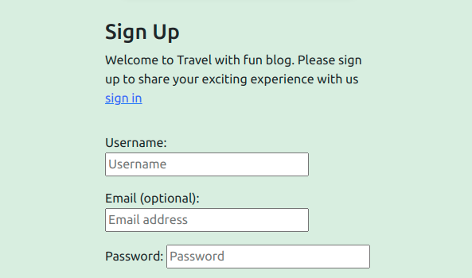

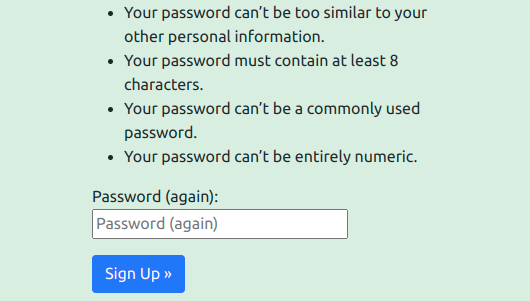

## Login Page

For the signed up user there is the login page where user has to put username and password. There is also a link to sign up for the new users here.

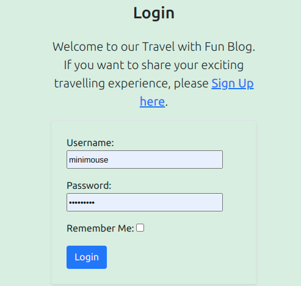

## Create Post

If the user is logged in they can go to the Create Post page. There are title, slub, content, status boxes along with save button. If the status is published then the post will appear in the home page. 

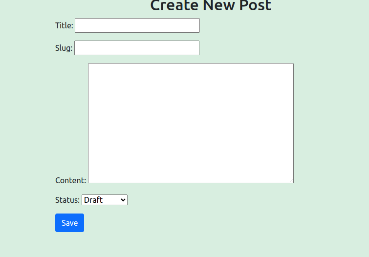

## Profile 

Profile page shows the username and profile image. There is a link to edit Your Profile.

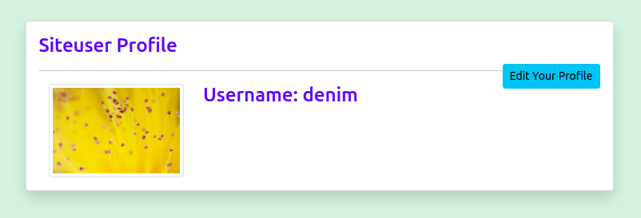

In the edit your Profile section user can update his/her username, upload a profile photo. If no photo is uploaded a default image is used.

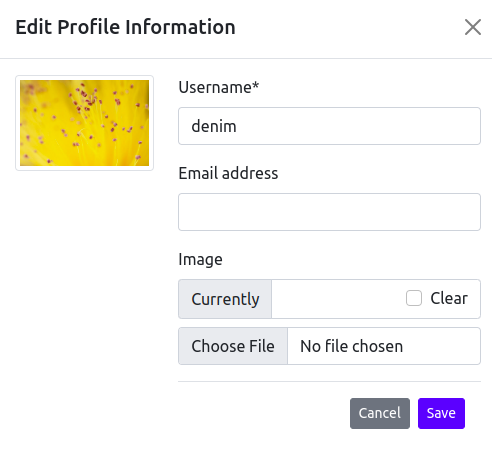

## Log Out

There is the Log out page asking the user if he really wants to go out.

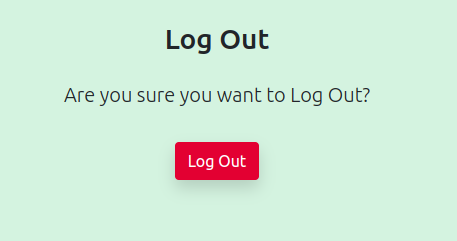

## Edit/Delete Blog

An user can edit or delete his/her own post. He has to be logged in to do so.

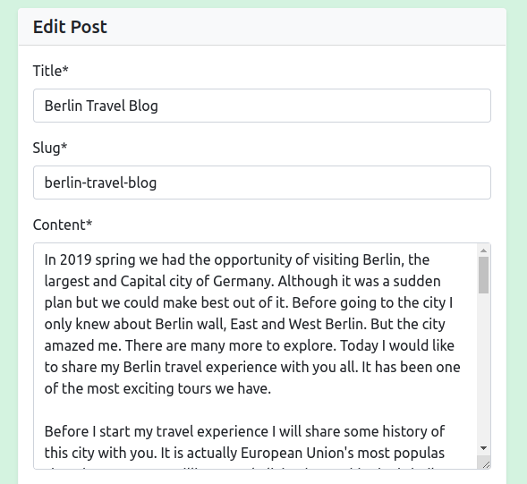

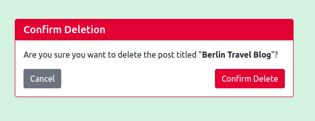

## Footer

There are clickable social media links in the footer.

## Future Features

* Add Comments: Add comments to the blog post by the users and use a counter for the comments.

* Use text formatter: Use text formatter such as summernote to beautify blog text.

# Technologies Used

* HTML
* CSS
* Python
* Postgres database

# Libraries, Frameworks & Tools

* Django 4.2.14 -  A high-level Python web framework used for developing the web application.
* Django-Allauth 0.57.2 - For user registration, login, and logout functionality.
* Gunicorn 20.1.0 - A Python WSGI HTTP server compatible with Django and used to run the project on Heroku
* Whitenoise5.3.0 - WhiteNoise is used for serving static files in a Django application.
* Cloudinary - cloud based storage for images.
* Heroku - for hosting and deployment of the site.
* Font Awesome - to use icons on the website.
* Github - to store and display all files and assets for the website.
* Bootstrap 5.0.1 - A Framework for building responsive sites
* Am I Responsive? - to test responsiveness on several devices.
* Lucidchart - to create Data Models.
* W3C vALIDATOR - to validate CSS and HTML
* Pixabay - for Photos used in the website.
* TinyPNG - Compresses images for website.
* Chrome DevTools - Web Developer Tools.
* Lighthouse - to test the accessibility of the website.
* Google Fonts - to import the fonts used on the website.
* Balsamiq - to create Wireframes.
* Coolors - to generate Colour Palette
* Code Institute's Python Linter - to check syntactical problems in Python source code

# Deployment

## Settings and Environment

* I added DATABASE_URL value and a SECRET_KEY value to the env.py file.
* then I imported the DATABASE_URL and SECRETKEY file paths into the settings.py file.
* My django was installed and i added it to requirement.txt.
* I created my project and added static file settings.
* I created a Procfile in the main directory.
* I added my workspace and Heroku into ALLOWED_HOSTS in settings.py.
* I did necessary migrations.

## Heroku Deployment

* I logged into Heroku as I already had an user accout and created new app with an unique neme.
* I connected Heroku with Github repository.
* After connection is established I went to settings tab. I clicked  'Reveal Config Vars' and added environment key & value variables which are DATABASE_URL & SECRET_KEY.
* Then I added DISABLE_COLLECTSTATIC as key and 1 as value to prevent errors.
* I clicked Add Buildpack to confirm Heroku buildpack is present.
* Then I went to Deploy section, search my repository and connected it.
* I chose manual deployment and my main branch where my project is present.
* After the deployment is finished my live site is viewed.

 