I performed both manual and automated testing for this project.

# Manual Testing

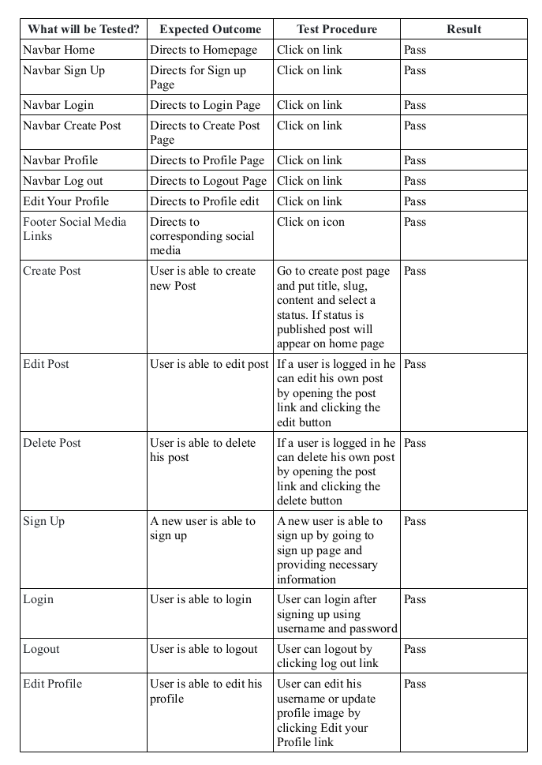

# Automated Testing

* travelblog/test_views.py

Tests the post detail view by creating new instances of the of the username, password,email(optional), title, slug, content and then populating the post detail with these created instances. The test then checks if all created instances are present.

* travelblog/test_forms.py

Tests the functionality of the PostForm and PostUpdateForm.

* siteuser/travelblog/test_forms.py

Tests the functionality of the SiteuserUpdateForm.

# Code Validation

## HTML

HTML validation is done by [W3C HTML Validator](https://validator.w3.org/)

Home Page - [home](https://validator.w3.org/nu/?doc=https%3A%2F%2Ftravelblogdjango-d9e22c4148cf.herokuapp.com%2F)

Sign Up - [sign up](https://validator.w3.org/nu/?doc=https%3A%2F%2Ftravelblogdjango-d9e22c4148cf.herokuapp.com%2Faccounts%2Fsignup%2F)

The signup form is taken from Django walkthrough project. That had 4 errors. So similar errors are inherited in my project.
For a clear understanding I am attaching the result of walkthrough Register page here.

Walkthrough register page -[register](https://validator.w3.org/nu/?doc=https%3A%2F%2Fdjango2farha-75ae79d0894c.herokuapp.com%2Faccounts%2Fsignup%2F)

Login Page - [login](https://validator.w3.org/nu/?doc=https%3A%2F%2Ftravelblogdjango-d9e22c4148cf.herokuapp.com%2Faccounts%2Flogin%2F)

Create Post - [create post](https://validator.w3.org/nu/?doc=https%3A%2F%2Ftravelblogdjango-d9e22c4148cf.herokuapp.com%2Fpost%2Fnew%2F)

Profile - [profile](https://validator.w3.org/nu/?doc=https%3A%2F%2Ftravelblogdjango-d9e22c4148cf.herokuapp.com%2Fprofile%2F)

Log Out - [logout](https://validator.w3.org/nu/?doc=https%3A%2F%2Ftravelblogdjango-d9e22c4148cf.herokuapp.com%2Faccounts%2Flogout%2F)

CSS validation is done by [W3C CSS Validator](https://jigsaw.w3.org/css-validator/)
CSS - [css](https://jigsaw.w3.org/css-validator/validator?uri=https%3A%2F%2Ftravelblogdjango-d9e22c4148cf.herokuapp.com%2Fstatic%2Fcss%2Fstyle.css&profile=css3svg&usermedium=all&warning=1&vextwarning=&lang=en)

# Lighthouse

Lighthouse was used to analyse the website for performance, accessibility, best practice and SEO. The results are given below:

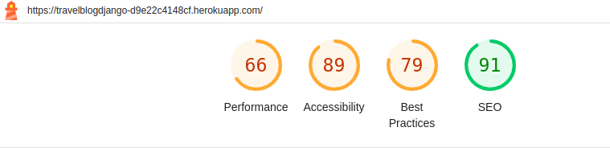

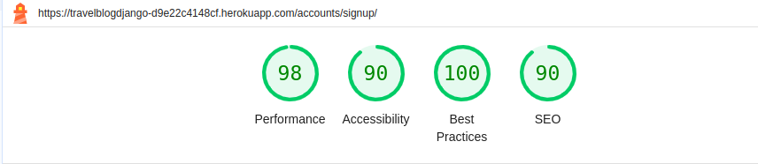

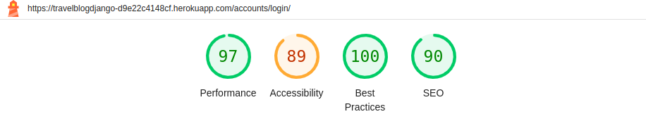

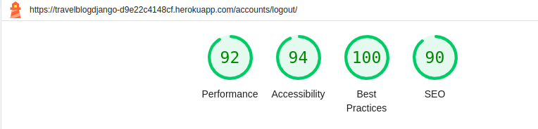

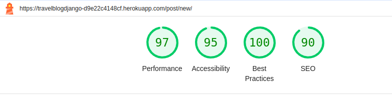

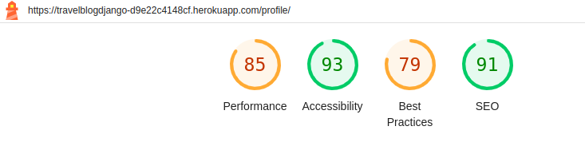

# Responsiveness Testing

The website is fully responsive. The responsiveness test result is given below:

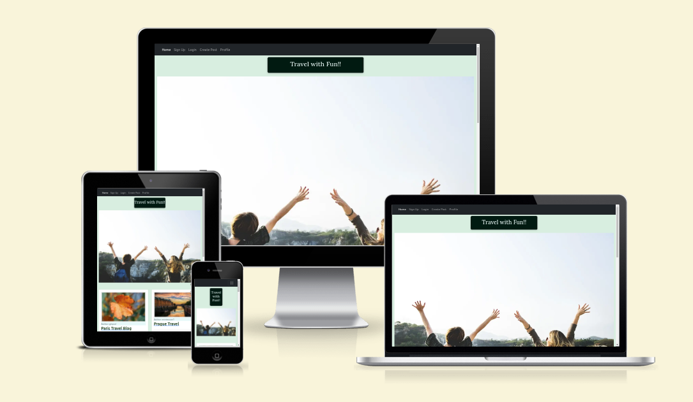

# CI Python Linter

* 

  
siteuser/forms.py

  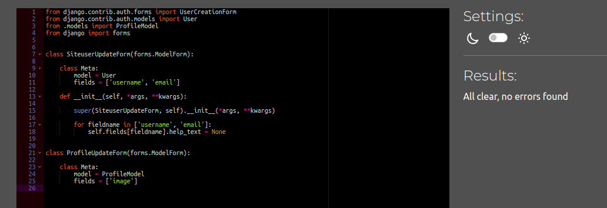

* 

  
siteuser/models.py

  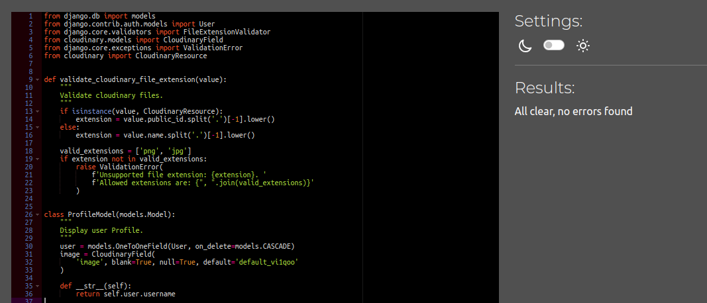

* 

  
siteuser/views.py

  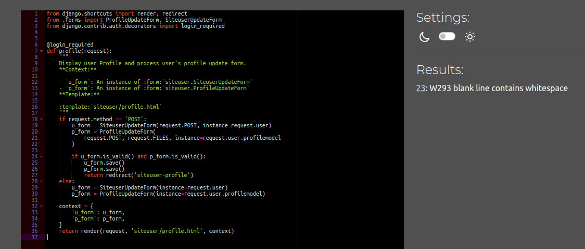

* 

  
travelblog/forms.py

  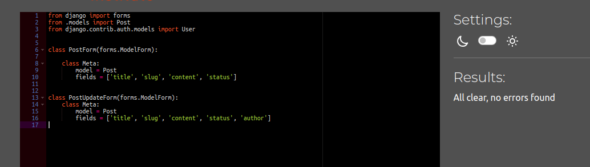

* 

  
travelblog/models.py

  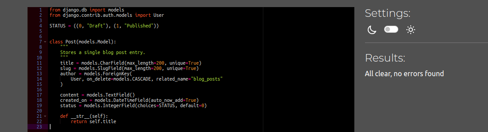

* 

  
travelblog/views.py

  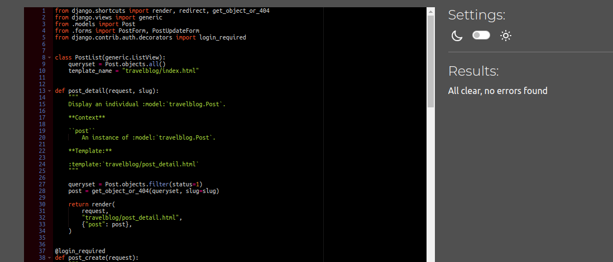

